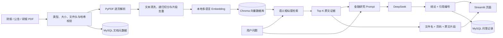
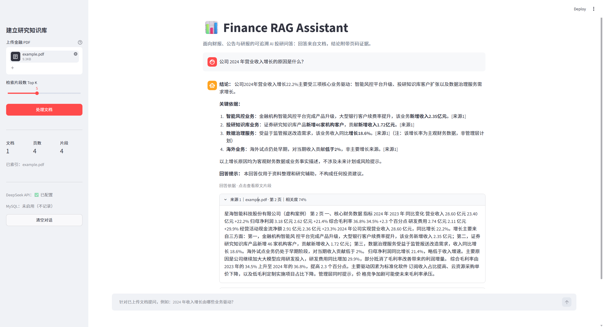
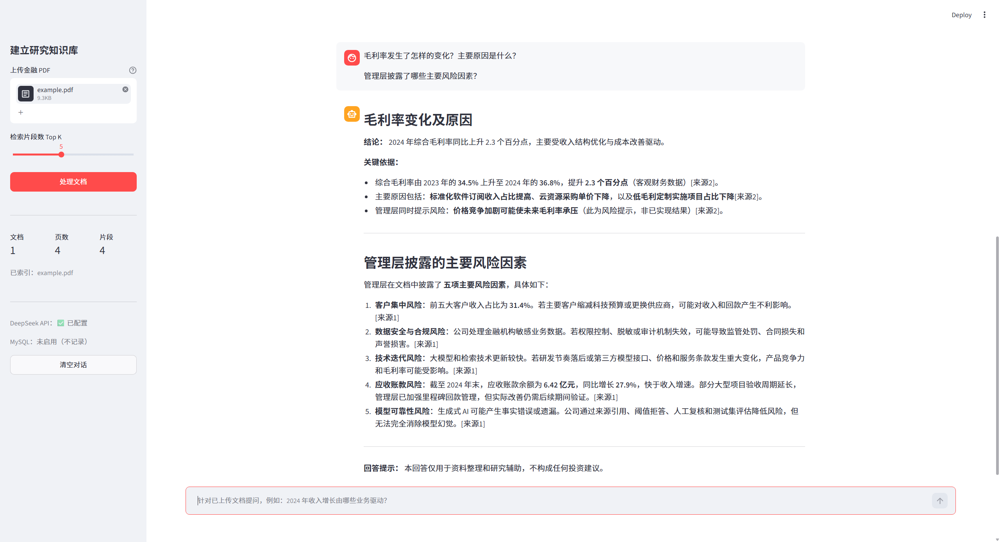

# Finance RAG Assistant

> 基于 RAG（Retrieval-Augmented Generation）的金融文档智能问答助手：上传财报、公告或研报，系统检索原文证据并由 DeepSeek 生成回答，页面同步展示文件名、页码和原文片段。

本项目面向 **AI 投研 / 金融科技 / 投研数据工程实习** 作品集。重点不是展示一个通用聊天机器人，而是解决投研资料阅读中的实际问题：文档长、信息分散、关键数字定位慢，以及 AI 回答缺少依据。

## 项目背景

分析师研究一家公司时，通常需要在年报、临时公告和研究报告之间反复搜索。关键词检索难以覆盖“收入为何增长”“利润率变化由什么驱动”这类语义问题，而直接把整份财报发给大模型又会面临上下文成本高、回答难追溯等问题。

Finance RAG Assistant 将资料预处理为可检索的本地向量知识库，只把与问题最相关的片段交给大模型，并展示引用证据，从而：

- 缩短财务指标、经营原因和风险因素的定位时间；
- 将回答绑定到原始文件与页码，便于分析师复核；
- 通过 Prompt 要求模型在证据不足时明确说明无法确定，降低“看起来合理但文档没有写”的风险；
- 把 AI 嵌入“资料收集 → 信息定位 → 证据复核”的投研流程。

典型投研场景包括：从年报中定位收入和毛利率驱动因素，跨公告核对管理层表述，检索风险提示与应收账款变化，以及为研究底稿保留可回查的文件名、页码和问答记录。项目将非结构化 PDF 的语义检索与结构化处理状态管理分开，便于后续接入数据治理和研究工作流。

## 系统架构



### 数据流程

1. **PDF 上传**：后端再次校验扩展名、MIME、PDF 文件头、空文件、单文件大小和批次总大小。
2. **重复识别**：计算原始文件 SHA-256；同批相同文档只处理一次，相同文档集合复用已有 Chroma 集合。
3. **解析**：`PyPDF` 按页提取文本，检查加密、损坏、空文本和扫描件情况，并保留文件名、页码和文件哈希。
4. **清洗与分块**：清理空字符和多余空白，使用 `RecursiveCharacterTextSplitter` 递归切分，再按文件哈希和正文去除重复片段。
5. **向量化与存储**：本地多语言 Embedding 模型生成语义向量并持久化到 `ChromaDB`；如启用 MySQL，同时记录文档哈希、片段数和处理状态。
6. **检索**：每次提问都重新执行余弦相似度检索，选择 Top K 原文证据。
7. **生成答案**：Prompt 要求 DeepSeek 依据检索证据回答，并使用 `[来源1]` 格式引用。
8. **来源展示与记录**：页面展示相关度、文件名、页码和原文；启用 MySQL 时，将问答关联到本轮检索命中的文档。

## 技术栈

| 模块 | 技术 | 选择原因 |
| --- | --- | --- |
| Web 界面 | Streamlit | 快速搭建适合项目演示的交互页面 |
| RAG 编排 | LangChain | 统一 Document、Embedding、检索与 LLM 接口 |
| 大语言模型 | DeepSeek API | 中文金融问答能力与调用成本较平衡 |
| Embedding | `paraphrase-multilingual-MiniLM-L12-v2` | 本地运行、支持中英文、文档无需发送给 Embedding API |
| 向量数据库 | ChromaDB | 轻量、本地持久化、支持相似度检索 |
| PDF 解析 | PyPDF | 直接按页提取可搜索 PDF 的文本 |
| 业务数据库 | MySQL（可选） | 保存文档处理状态和问答记录，不承担语义检索 |

## 功能展示

- 多 PDF 上传：支持同时建立年报、公告、研报知识库；
- 金融文本处理：逐页解析、中文友好切分、页码元数据保留；
- 向量缓存：相同文档通过内容指纹复用已建立的 Chroma 集合；
- 数据质量：文件哈希识别重复上传，切分后去除同一文档中的重复片段；
- 可追溯问答：Prompt 要求答案引用 `[来源N]`，界面显示文件名、页码、相关度和原文；
- 金融约束 Prompt：要求区分客观数据、管理层陈述和未来计划，并在证据不足时说明无法确定；
- 多轮对话：保留最近三轮语境，每个问题仍重新检索证据；
- 可选 MySQL：记录文档状态与问答历史；未配置或连接失败时自动降级，不影响问答；
- 可观测性：上传、解析、切分、向量化和模型调用等关键步骤输出日志，数据库失败时记录降级警告；
- 数据安全：API Key 与数据库密码通过环境变量读取，本地 `.env` 已被 Git 忽略。

可直接使用 [`data/example.pdf`](data/example.pdf) 体验。该 PDF 是虚构公司的 4 页经营摘要，包含财务数据、收入增长原因、毛利率变化和风险因素。

推荐提问：

```text
公司 2024 年营业收入增长的原因是什么？
毛利率发生了怎样的变化？主要驱动因素是什么？
应收账款是否存在值得关注的风险？
公司是否给出了 2025 年收入预测？
```

## 快速开始

### 1. 获取项目并创建虚拟环境

要求 Python 3.10～3.12。推荐使用 3.11。

```bash
git clone https://github.com/tiancaiwameng/Finance-RAG-Assistant.git
cd Finance-RAG-Assistant
```

Windows PowerShell：

```powershell
py -3.11 -m venv .venv
.\.venv\Scripts\Activate.ps1
python -m pip install --upgrade pip
pip install -r requirements.txt
```

macOS / Linux：

```bash
python3 -m venv .venv
source .venv/bin/activate
python -m pip install --upgrade pip
pip install -r requirements.txt
```

> 首次建立知识库时会从 Hugging Face 下载本地 Embedding 模型，之后使用本地缓存。

### 2. 配置环境变量

```bash
cp .env.example .env
```

Windows PowerShell：

```powershell
Copy-Item .env.example .env
```

编辑 `.env`：

```dotenv
DEEPSEEK_API_KEY=你的真实密钥
DEEPSEEK_MODEL=deepseek-v4-flash
```

真实 `.env` 已被 `.gitignore` 排除。模型名称可按 DeepSeek 账号当前可用模型调整。

MySQL 是可选项。无需数据库时保持 `MYSQL_ENABLED=false`；需要记录元数据与问答历史时，先启动 MySQL，再配置：

```dotenv
MYSQL_ENABLED=true
MYSQL_HOST=127.0.0.1
MYSQL_PORT=3306
MYSQL_USER=finance_rag_user
MYSQL_PASSWORD=你的数据库密码
MYSQL_DATABASE=finance_rag
MYSQL_CONNECT_TIMEOUT=3
```

启动时会自动创建数据库和下列表（数据库账号需具备 `CREATE DATABASE`、`CREATE TABLE`、读写权限）。如果权限不足或连接失败，页面会显示“连接失败（已降级）”，应用继续使用 Chroma 和 DeepSeek，不写 MySQL。

### 3. 启动应用

```bash
streamlit run app.py
```

浏览器会打开 `http://localhost:8501`。上传 PDF，点击“处理文档”，完成后即可提问。

## 项目结构

```text
Finance-RAG-Assistant/
├── README.md
├── requirements.txt
├── .env.example
├── .gitignore
├── LICENSE
├── app.py                    # Streamlit 页面和会话状态
├── config.py                 # 环境变量与 RAG 参数
├── src/
│   ├── __init__.py
│   ├── pipeline.py           # 上传校验、文件哈希与批次去重
│   ├── pdf_loader.py         # PDF 逐页解析、切分
│   ├── vector_store.py       # Embedding、Chroma、相似度检索
│   ├── rag_chain.py          # DeepSeek 提示词与答案生成
│   ├── database.py           # 可选 MySQL 初始化与数据访问
│   └── utils.py              # 文本清洗、指纹和来源格式化
├── data/
│   └── example.pdf           # 可直接演示的虚构金融资料
├── docs/
│   └── INTERVIEW_GUIDE.md    # 面试讲解与高频追问
└── screenshots/
    ├── answer-with-sources.png
    └── multi-question-analysis.png
```


## 运行截图

### 单问题检索与来源追踪



### 多维度金融问题分析



## MySQL 数据模型

应用启动时会自动执行幂等建表逻辑，不需要手工维护 SQL。MySQL 关闭或异常时，以下写入会被跳过。

### `documents`

| 字段 | 类型 | 说明 |
| --- | --- | --- |
| `id` | BIGINT | 文档主键 |
| `filename` | VARCHAR(255) | 安全化后的上传文件名 |
| `file_hash` | CHAR(64) | 原始文件 SHA-256，唯一索引，用于重复识别 |
| `upload_time` | DATETIME | 最近一次上传时间 |
| `chunk_count` | INT | 去重后的片段数量 |
| `processing_status` | VARCHAR(32) | `processing`、`completed` 或 `failed` |

### `qa_history`

| 字段 | 类型 | 说明 |
| --- | --- | --- |
| `id` | BIGINT | 问答记录主键 |
| `document_id` | BIGINT | 外键，指向本轮检索命中的文档 |
| `question` | TEXT | 用户问题 |
| `answer` | MEDIUMTEXT | 模型答案 |
| `created_at` | DATETIME | 记录创建时间 |

多文档答案会为本轮检索命中的每个文档写入一条关联记录，因此同一问题和答案可能对应多条 `qa_history` 记录。

### Chroma 与 MySQL 的职责

| 存储 | 保存内容 | 主要用途 | 是否必需 |
| --- | --- | --- | --- |
| Chroma | 文本片段、Embedding 向量和页码等检索元数据 | 语义相似度检索与来源召回 | 是 |
| MySQL | 文档哈希、处理状态、片段数和问答历史 | 结构化查询、审计和业务记录 | 否；失败时自动降级 |

两者不是替代关系：Chroma 解决“哪些原文与问题最相关”，MySQL 解决“哪些文档处理过、处理结果如何、产生过哪些问答”。

## 设计取舍

### 为什么 Embedding 不使用 DeepSeek？

LLM 与 Embedding 是两个独立环节。项目使用 DeepSeek 生成回答，使用本地多语言模型生成向量。这样能减少文档外发、降低重复索引成本，并体现模型组件可替换的工程设计。

### 为什么要保留页码？

投研结论必须可复核。页码在 PDF 解析阶段写入每个 `Document` 的 metadata，切分后继续继承；检索结果因此能回到原始文档位置，而不只是展示一段脱离上下文的文字。

### 如何降低幻觉？

- Prompt 明确要求只依据检索证据；
- Prompt 要求每条关键判断引用来源编号；
- Prompt 要求模型在证据不足时说明无法确定；
- 页面展示原文，让使用者进行人工复核。

这不能完全消除幻觉。真实投研系统还应增加检索评测、答案一致性检查和人工审核。

## 已知限制

- PyPDF 适合可搜索 PDF；扫描件需要先做 OCR；
- 复杂跨页表格可能被按阅读顺序提取，数值关系需要人工复核；
- 当前相关度是向量余弦距离的直观转换，不等同于统计概率；
- 当前未做按证券代码、报告期、文档类型的 metadata 过滤；
- MySQL 只记录文档级元数据和问答结果，不保存每个 Chroma 片段的结构化明细；
- 本项目是研究辅助工具，不构成投资建议，不能代替原始公告与专业判断。

## 常见错误排查

| 现象 | 原因与处理 |
| --- | --- |
| `.venv` 无法激活或指向不存在的 Python | 删除本机旧 `.venv` 后，重新执行 `py -3.11 -m venv .venv`（Windows）或 `python3 -m venv .venv`（macOS/Linux） |
| 首次处理长期停留在模型下载 | Embedding 模型首次从 Hugging Face 下载；检查网络、代理和磁盘空间，之后会使用本地缓存 |
| 提示文件不是有效 PDF | 确认扩展名、MIME 和文件头真实匹配；不要只把其他格式改名为 `.pdf` |
| 提示未提取到文本 | PDF 可能是扫描件或空文档，请先 OCR 后再上传 |
| DeepSeek 调用失败 | 检查 `.env` 中的 API Key、模型名、余额和网络，修改后重启 Streamlit |
| MySQL 显示“连接失败（已降级）” | 检查服务是否启动、主机端口、账号权限和数据库名并重启应用；不需要记录时设置 `MYSQL_ENABLED=false` |
| Chroma 写入或检索失败 | 检查 `chroma_db/` 的写权限与磁盘空间，必要时在停止应用后备份并移除损坏的本地集合 |

## 后续优化方向

1. **金融表格增强**：引入 `pdfplumber` / OCR 与表格结构解析，单独索引三大财务报表；
2. **Hybrid Search**：结合 BM25 关键词检索与向量检索，提升证券简称、会计科目和精确数字召回；
3. **Reranker**：对初步召回片段二次排序，降低 Top K 中的噪声；
4. **Metadata Filter**：增加公司、报告期、文档类型筛选，支持跨期对比；
5. **检索评测**：构建“问题—标准证据页—标准答案”小型测试集，评估 Hit@K、MRR、引用准确率与拒答率；
6. **结构化指标抽取**：将收入、利润率、现金流等指标落入表格，支持同比/环比分析和可视化；
7. **生产化能力**：增加用户隔离、访问控制、敏感信息脱敏、调用日志和成本监控。

## 面试讲解

面试时不要只说“我调用了大模型 API”。建议用四句话讲清楚：

> 我发现财报和公告篇幅长，分析师定位经营原因与风险因素效率较低，所以做了一个金融文档 RAG 助手。系统逐页解析 PDF、进行中文文本切分并写入 Chroma，提问时先检索证据，再通过 Prompt 要求 DeepSeek 基于证据回答。与普通聊天 Demo 不同，我保留了文件名、页码、相关度和原文片段，让每个结论可以回到公告复核。我还通过 Prompt 要求模型区分数字口径、管理层计划与已实现业绩，并在证据不足时说明无法确定。

面向 AI 投研数据工程岗位，可以继续强调这次增量升级：在不推翻 RAG 主链路的前提下，为输入数据增加类型、大小、文件头和哈希校验，在解析与切分阶段处理空文本和重复内容，用日志与分层异常提高可观测性；同时用 Chroma 承担语义向量检索、用可选 MySQL 承担文档状态和问答审计，并设计了数据库失败时的降级路径。这体现的是数据质量、数据血缘、可观测性和系统韧性，而不只是调用模型 API。

完整 1 分钟 / 3 分钟讲解、项目难点和追问答案见 [`docs/INTERVIEW_GUIDE.md`](docs/INTERVIEW_GUIDE.md)。

## License

[MIT](LICENSE)
